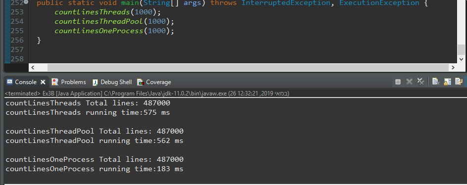

# Threads
Codding by: Mulugeta
* Exercise number 3 on Computer Science and Mathematics , Ariel University 2019.

There is two programs that using threads.
The first program check ikf the giving number is prime or not	within a given time. 
If the program success to check that the giving number is prime or not
    within a given time it will return true or false
Else return RuntimeException.
The second program shows the deffrince between Thread,ThreadPool and Process.
The program creat files,read from file and count lines.
The program print tootal line numbers and running time.
The program deleet all created files.

##Built With
* [Project site](https://github.com/mulugetaf/oopEx3)
* [Reference source](https://stackoverflow.com/questions/200469/what-is-the-difference-between-a-process-and-a-thread)
* [Reference source](https://stackoverflow.com/questions/50542940/java-stop-an-endless-loop-function-by-a-thread)

##Example of the program
* The first program:By givin number 33333331 and 0.01 ms The program return true(isPrime)
* The second program:
